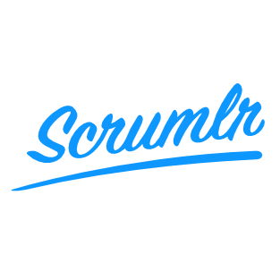

> The code of the online version of [scrumlr.io](https://scrumlr.io) is located
> [at the v1 branch](https://github.com/inovex/scrumlr.io/tree/v1), since we are currently working on a new
> implementation of your favorite webapp for collaborative sessions.

<div align="center" markdown="1" style="margin-bottom: 2.5em">
  <p>
    
  </p>
  <p>
    <a href="https://github.com/inovex/scrumlr.io/actions/workflows/continuous-integration.yml">
      
    </a>
  </p>
</div>

Webapp for collaborative online retrospectives hosted on [scrumlr.io](https://scrumlr.io).
Read our ['Welcome' wiki page](https://github.com/inovex/scrumlr.io/wiki/Welcome) to learn more
about the history and the vision of this tool.

This project is written in [React](https://reactjs.org/) on top of the [Parse Platform](https://parseplatform.org/).

# Getting Started

Checkout the sources.

```bash
$ git clone git@github.com:inovex/scrumlr.io.git
$ cd scrumlr.io
```

## Prerequisites

- [Node.js](https://nodejs.org/)
- [yarn](https://yarnpkg.com/)
- [Docker](https://www.docker.com/)
- _(optional)_ [minikube](https://kubernetes.io/docs/tasks/tools/)
- _(optional)_ [kubectl](https://kubernetes.io/docs/tasks/tools/)

## Run

1. run the server (backend) with docker

    ```bash
    $ docker compose --project-directory server/ up -d
    ```

    *If server code has been changed make sure to run it with the `--build` option.


2. run the client (frontend)

    ```bash
    $ yarn install
    $ yarn start
    ```

   The client will become available on [http://localhost:3000](http://localhost:3000)

<details>
  <summary>Read more on alternative development setups</summary>

  ## Run local Kubernetes development environment

  You can **optionally** run the server on a local Kubernetes setup for development.

  ### minikube

  1. **Use the Docker daemon for minikube**

     To make sure our local docker-built images are used for our minikube deployments.

      ```bash
      $ eval $(minikube docker-env)
      ```
     Important note: You have to run eval `$(minikube docker-env)` on each terminal you want to use, since it only sets the environment variables for the current shell session.

  2. **Start your cluster**

      ```bash
      $ minikube start
      ```

     Optional: You can increase the available cpu cores and memory size in Docker desktop. The allocated resources can then also be used for minikube (e.g. 4 CPU cores and 8GB of ram):
      ```bash
      $ minikube start --cpus 4 --memory 7962
      ```

  3. **Create Nginx Ingress Controller**

      ```bash
      $ kubectl apply -f https://raw.githubusercontent.com/kubernetes/ingress-nginx/controller-v0.47.0/deploy/static/provider/cloud/deploy.yaml
      ```

  4. **Run our deployment script**

     The build script will automatically search for all needed docker images, build them if they're missing and the deployment script will deploy all Kubernetes resources afterwards.
      ```bash
      $ cd deployment
      $ sh build.sh
      $ sh deploy.sh
      ```

  5. **Create a minikube tunnel**

     The minikube tunnel is needed so that our Ingress can be reached on `127.0.0.1`.
      ```bash
      $ minikube tunnel
      ```

  ### Docker-Desktop

  On MacOS and Windows machines you could also use the Docker Desktop application as Kubernetes context.

  1. **Enable Kubernetes**

     To enable Kubernetes support and install a standalone instance of Kubernetes running as a Docker container, go to `Docker Desktop > Preferences > Kubernetes` and then click `Enable Kubernetes`.

  2. **Make sure to use the correct Kubernetes context**

     Ensure that the context is pointing to `docker-desktop`.

      ```bash
      $ kubectl config get-contexts
      $ kubectl config use-context docker-desktop
      ```

  3. **Create Nginx Ingress Controller**

      ```bash
      $ kubectl apply -f https://raw.githubusercontent.com/kubernetes/ingress-nginx/controller-v0.47.0/deploy/static/provider/cloud/deploy.yaml
      ```

  4. **Run our build & deployment script**

     The build script will automatically search for all needed docker images, build them if they're missing and the deployment script will deploy all Kubernetes resources afterwards.
      ```bash
      $ cd deployment
      $ sh build.sh
      $ sh deploy.sh
      ```
</details>

## Contributing

You're very welcome to be part of this project. You can contribute by opening an issue, by
fixing a bug or by adding a feature and open a pull request. Just make sure that the jobs
`yarn test` and `yarn lint` are passing and that every change is covered by unit tests.

## Thank you

Thanks to all our users, contributors & supporters! ❤️

## License

Scrumlr is [MIT licensed](https://github.com/inovex/scrumlr.io/blob/main/LICENSE).
