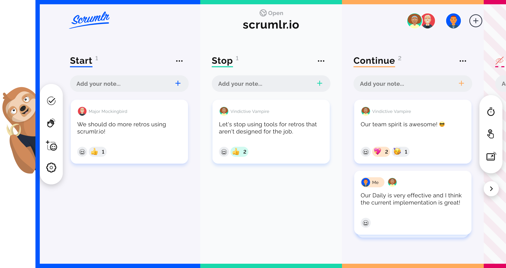

  

<h3 align="center">Online retrospectives made easy</h3>

<a href="https://scrumlr.io">scrumlr.io</a> is an online collaboration tool that helps teams reach new heights. Start your first retrospective or collaborative session in an instant - no registration required and completely free and open source. 

---

  
  
  

  

## Features

- 🔁 Retrospectives made easy.
- 🤝 Collaborate with your team.
- 💯 Free & open-source.
- 🕵️ No registration required.
- 🌓 Dark mode.
- 📱 Responsive.
- 👅 Localization (i18n) support.
- 📋 Export to PDF, JSON, CSV and Markdown.

## Contributing

- Missing something? Add a **Proposal** to [GitHub Discussions.](https://github.com/inovex/scrumlr.io/discussions/new?category=proposals)
- Found a bug? [Report here!](https://github.com/inovex/scrumlr.io/issues)
- Want to contribute? Check out our [contribution guide.](https://github.com/inovex/scrumlr.io/blob/main/CONTRIBUTING.md)

## Documentation
You can find the full documentation at [docs.scrumlr.io](https://docs.scrumlr.io).
This includes a guide on how to self-host Scrumlr, how to contribute, and more.

## Collaborators and beloved friends

Thanks to all our users, collaborators, contributors & supporters! ❤️

<!-- readme: collaborators,contributors -start -->
<table>
	<tbody>
		<tr>
            <td align="center">
                <a href="https://github.com/Schwehn42">
                    
                     
                    <b>Schwehn42</b>
                </a>
            </td>
            <td align="center">
                <a href="https://github.com/wischoepke">
                    
                     
                    <b>wischoepke</b>
                </a>
            </td>
            <td align="center">
                <a href="https://github.com/quand513">
                    
                     
                    <b>quand513</b>
                </a>
            </td>
            <td align="center">
                <a href="https://github.com/SimonRocker">
                    
                     
                    <b>SimonRocker</b>
                </a>
            </td>
            <td align="center">
                <a href="https://github.com/Resaki1">
                    
                     
                    <b>Resaki1</b>
                </a>
            </td>
            <td align="center">
                <a href="https://github.com/brandstetterm">
                    
                     
                    <b>brandstetterm</b>
                </a>
            </td>
            <td align="center">
                <a href="https://github.com/jmoehler">
                    
                     
                    <b>jmoehler</b>
                </a>
            </td>
		</tr>
		<tr>
            <td align="center">
                <a href="https://github.com/mateo-ivc">
                    
                     
                    <b>mateo-ivc</b>
                </a>
            </td>
            <td align="center">
                <a href="https://github.com/Planlos5000">
                    
                     
                    <b>Planlos5000</b>
                </a>
            </td>
            <td align="center">
                <a href="https://github.com/SerseusWasTaken">
                    
                     
                    <b>SerseusWasTaken</b>
                </a>
            </td>
            <td align="center">
                <a href="https://github.com/Lennart01">
                    
                     
                    <b>Lennart01</b>
                </a>
            </td>
            <td align="center">
                <a href="https://github.com/tohega">
                    
                     
                    <b>tohega</b>
                </a>
            </td>
            <td align="center">
                <a href="https://github.com/mating02">
                    
                     
                    <b>mating02</b>
                </a>
            </td>
            <td align="center">
                <a href="https://github.com/SelinaBuff">
                    
                     
                    <b>SelinaBuff</b>
                </a>
            </td>
		</tr>
		<tr>
            <td align="center">
                <a href="https://github.com/malterusko-ino">
                    
                     
                    <b>malterusko-ino</b>
                </a>
            </td>
            <td align="center">
                <a href="https://github.com/bitionaire">
                    
                     
                    <b>bitionaire</b>
                </a>
            </td>
            <td align="center">
                <a href="https://github.com/Dominik-Weinzierl">
                    
                     
                    <b>Dominik-Weinzierl</b>
                </a>
            </td>
            <td align="center">
                <a href="https://github.com/BenedictHomuth">
                    
                     
                    <b>BenedictHomuth</b>
                </a>
            </td>
            <td align="center">
                <a href="https://github.com/ffischbach">
                    
                     
                    <b>ffischbach</b>
                </a>
            </td>
            <td align="center">
                <a href="https://github.com/CronJorian">
                    
                     
                    <b>CronJorian</b>
                </a>
            </td>
            <td align="center">
                <a href="https://github.com/louiskroener">
                    
                     
                    <b>louiskroener</b>
                </a>
            </td>
		</tr>
		<tr>
            <td align="center">
                <a href="https://github.com/timengel">
                    
                     
                    <b>timengel</b>
                </a>
            </td>
            <td align="center">
                <a href="https://github.com/Benjosh95">
                    
                     
                    <b>Benjosh95</b>
                </a>
            </td>
            <td align="center">
                <a href="https://github.com/b8daniel">
                    
                     
                    <b>b8daniel</b>
                </a>
            </td>
            <td align="center">
                <a href="https://github.com/NNKKOO">
                    
                     
                    <b>NNKKOO</b>
                </a>
            </td>
            <td align="center">
                <a href="https://github.com/jeancloudvanlang">
                    
                     
                    <b>jeancloudvanlang</b>
                </a>
            </td>
            <td align="center">
                <a href="https://github.com/BingeCode">
                    
                     
                    <b>BingeCode</b>
                </a>
            </td>
            <td align="center">
                <a href="https://github.com/alphapfote">
                    
                     
                    <b>alphapfote</b>
                </a>
            </td>
		</tr>
		<tr>
            <td align="center">
                <a href="https://github.com/kersten">
                    
                     
                    <b>kersten</b>
                </a>
            </td>
            <td align="center">
                <a href="https://github.com/andiKandi">
                    
                     
                    <b>andiKandi</b>
                </a>
            </td>
            <td align="center">
                <a href="https://github.com/liza-kl">
                    
                     
                    <b>liza-kl</b>
                </a>
            </td>
            <td align="center">
                <a href="https://github.com/laila-rin">
                    
                     
                    <b>laila-rin</b>
                </a>
            </td>
            <td align="center">
                <a href="https://github.com/busilina">
                    
                     
                    <b>busilina</b>
                </a>
            </td>
            <td align="center">
                <a href="https://github.com/seschi98">
                    
                     
                    <b>seschi98</b>
                </a>
            </td>
            <td align="center">
                <a href="https://github.com/doppelreim">
                    
                     
                    <b>doppelreim</b>
                </a>
            </td>
		</tr>
		<tr>
            <td align="center">
                <a href="https://github.com/coehne">
                    
                     
                    <b>coehne</b>
                </a>
            </td>
            <td align="center">
                <a href="https://github.com/jdolinga">
                    
                     
                    <b>jdolinga</b>
                </a>
            </td>
            <td align="center">
                <a href="https://github.com/dipesh1903">
                    
                     
                    <b>dipesh1903</b>
                </a>
            </td>
            <td align="center">
                <a href="https://github.com/berndkaiser">
                    
                     
                    <b>berndkaiser</b>
                </a>
            </td>
            <td align="center">
                <a href="https://github.com/Yaazizi">
                    
                     
                    <b>Yaazizi</b>
                </a>
            </td>
            <td align="center">
                <a href="https://github.com/Janovic1th">
                    
                     
                    <b>Janovic1th</b>
                </a>
            </td>
            <td align="center">
                <a href="https://github.com/Aejkatappaja">
                    
                     
                    <b>Aejkatappaja</b>
                </a>
            </td>
		</tr>
		<tr>
            <td align="center">
                <a href="https://github.com/fabian-rapp">
                    
                     
                    <b>fabian-rapp</b>
                </a>
            </td>
            <td align="center">
                <a href="https://github.com/hikhvar">
                    
                     
                    <b>hikhvar</b>
                </a>
            </td>
            <td align="center">
                <a href="https://github.com/kedorlaomer">
                    
                     
                    <b>kedorlaomer</b>
                </a>
            </td>
            <td align="center">
                <a href="https://github.com/varungujarathi9">
                    
                     
                    <b>varungujarathi9</b>
                </a>
            </td>
            <td align="center">
                <a href="https://github.com/shikharvashistha">
                    
                     
                    <b>shikharvashistha</b>
                </a>
            </td>
            <td align="center">
                <a href="https://github.com/Quasilius-Starlord">
                    
                     
                    <b>Quasilius-Starlord</b>
                </a>
            </td>
            <td align="center">
                <a href="https://github.com/NatanaelJan">
                    
                     
                    <b>NatanaelJan</b>
                </a>
            </td>
		</tr>
		<tr>
            <td align="center">
                <a href="https://github.com/Martheos">
                    
                     
                    <b>Martheos</b>
                </a>
            </td>
            <td align="center">
                <a href="https://github.com/the-homeless-god">
                    
                     
                    <b>the-homeless-god</b>
                </a>
            </td>
            <td align="center">
                <a href="https://github.com/m-njot-singh">
                    
                     
                    <b>m-njot-singh</b>
                </a>
            </td>
            <td align="center">
                <a href="https://github.com/Loule95450">
                    
                     
                    <b>Loule95450</b>
                </a>
            </td>
            <td align="center">
                <a href="https://github.com/Zaunei">
                    
                     
                    <b>Zaunei</b>
                </a>
            </td>
            <td align="center">
                <a href="https://github.com/UiP9AV6Y">
                    
                     
                    <b>UiP9AV6Y</b>
                </a>
            </td>
            <td align="center">
                <a href="https://github.com/CodeBrauer">
                    
                     
                    <b>CodeBrauer</b>
                </a>
            </td>
		</tr>
		<tr>
            <td align="center">
                <a href="https://github.com/dani">
                    
                     
                    <b>dani</b>
                </a>
            </td>
            <td align="center">
                <a href="https://github.com/Avalancs">
                    
                     
                    <b>Avalancs</b>
                </a>
            </td>
		</tr>
	<tbody>
</table>
<!-- readme: collaborators,contributors -end -->

## Sponsors

A special shout-out goes to [inovex](https://inovex.de) for all the support and the opportunity to realize this project! 🙌
[Contact us](https://www.inovex.de/de/kontakt/) if you look for the best IT service provider out there.

  

## License

See the [LICENSE](./LICENSE) file for licensing information.
