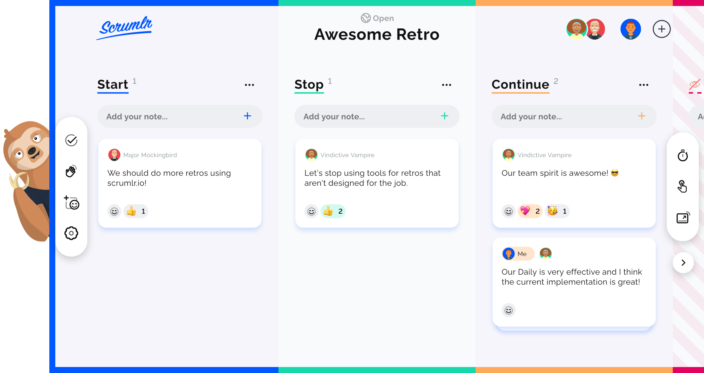

  

<h3 align="center">Online retrospectives made easy</h3>

<a href="https://scrumlr.io">scrumlr.io</a> is an online collaboration tool that helps teams reach new heights. Start your first retrospective or collaborative session in an instant - no registration required and completely free and open source. 

---

  
  
  

  

## Features
- 💯 Free & open-source.
- 🕵️ No registration required.
- 🔁 Retrospectives made easy.
- 🤝 Collaborate with your team.
- 🌓 Dark mode.
- 📱 Responsive.
- 👅 Localization (i18n) support.
- 📋 Export to PDF, JSON, CSV and Markdown.

## Contributing

- Missing something? Add a **Proposal** to [GitHub Discussions.](https://github.com/inovex/scrumlr.io/discussions/new?category=proposals)
- Found a bug? [Report here!](https://github.com/inovex/scrumlr.io/issues)
- Want to contribute? Check out our [contribution guide.](https://github.com/inovex/scrumlr.io/blob/main/CONTRIBUTING.md)

## Collaborators and beloved friends
Thanks to all our users, collaborators, contributors & supporters! ❤️

... and many more!

## Sponsors
A special shout-out goes to [inovex](https://inovex.de) for all the support and the opportunity to realize this project! 🙌
[Contact us](https://www.inovex.de/de/kontakt/) if you look for the best IT service provider out there.

  

## License

See the [LICENSE](./LICENSE) file for licensing information.
