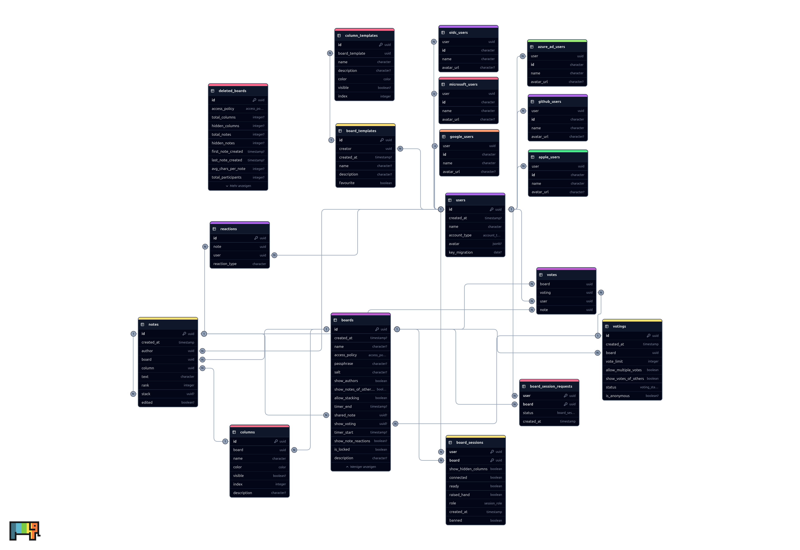

The following diagram shows the Scrumlr database layout.

The diagram was created with [ChartDB](https://github.com/chartdb/chartdb)

## Migrations

On startup of the Scrumlr backend, migrations for the database are automatically applied to the configured database.
