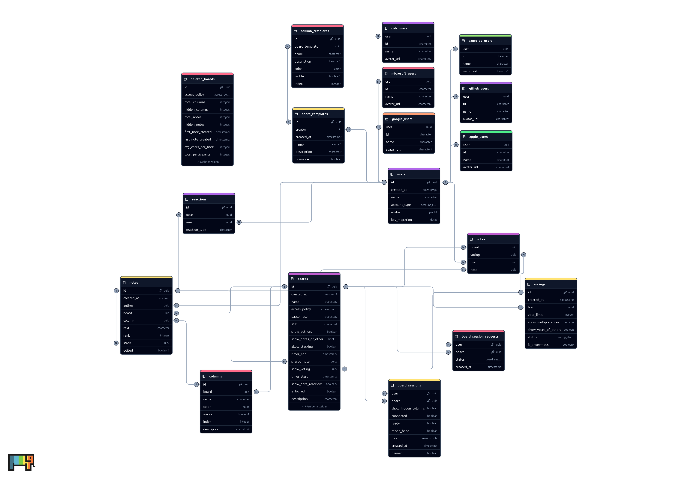

The following diagram shows the Scrumlr database layout.



The diagram was created with [ChartDB](https://github.com/chartdb/chartdb)

## Migrations

On startup of the Scrumlr backend, migrations for the database are automatically applied to the configured database
using [migrate](https://github.com/golang-migrate/migrate).
The migration step applies all migrations in the [migrations folder](https://github.com/inovex/scrumlr.io/tree/main/server/src/initialize/migrations/sql).

**Note**: The automatic migrations **cannot** apply down migrations. These need to be executed manually.

The logs of the server will show you the current migration and if a migration happend.

## Inspect the database

To inspect the database you can either use the commandline tool `psql` or a tool like [pgadmin](https://www.pgadmin.org/).

To connect to the database with psql you can either use the database connection string

```bash
psql postgresql://<user>:<password>@<host>:<port>/<database>?sslmode=disable
```

or the command

```bash
psql -h <host> -p <port> -d <database> -U <user>
```

after you successfully logge into your database, you can the execute your sql commands and inspect the database.
