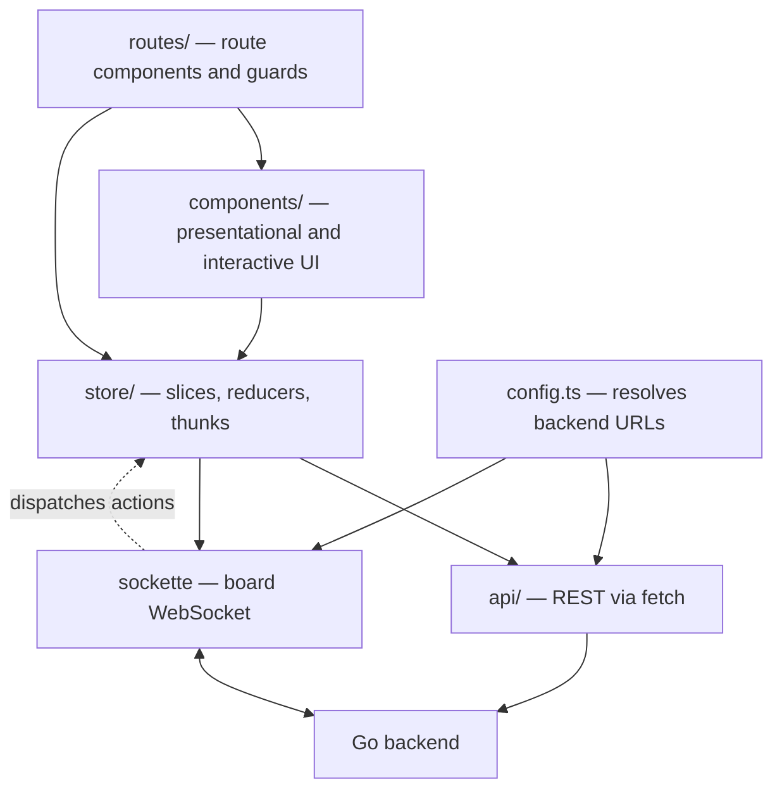
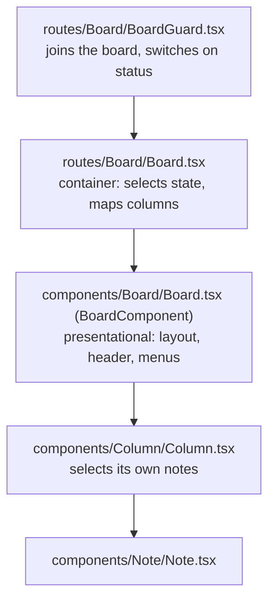

## Layers



The dotted arrow is the part that matters. Components dispatch thunks, thunks call REST, and the resulting state change
arrives back **over the WebSocket** as a separate action. State is not updated by the thunk that caused the change. See
[State & Realtime](/docs/src/content/docs/dev/frontend/state-management.md) for why, and what it means for the code you write.

## Entry point

`src/index.tsx` is short and worth reading in full. It:

1. Stores the app version from `import.meta.env.VITE_VERSION` in `localStorage`.
2. Initialises [Plausible](https://plausible.io) analytics if `ANALYTICS_DATA_DOMAIN` and `ANALYTICS_SRC` are set.
   Board URLs are SHA-256-hashed before being reported, so board ids never leave the browser in plain text.
3. Renders the provider stack into `#root`:

   ```tsx
   <React.StrictMode>
     <I18nextProvider i18n={i18n}>
       <Provider store={store}>
         <HelmetProvider>
           <Html />
           <Suspense fallback={<LoadingScreen />}>
             <ToastContainer limit={2} />
             <Router />
             {SHOW_LEGAL_DOCUMENTS && <CookieNotice />}
           </Suspense>
         </HelmetProvider>
       </Provider>
     </I18nextProvider>
   </React.StrictMode>
   ```

4. Dispatches `initAuth()` **after** the render call, which is what populates `state.auth`.

`<Html />` is not markup — it uses `react-helmet-async` to set the `lang` and `data-theme` attributes on the `<html>`
element. That single attribute drives the entire dark mode implementation; see
[Styling & Theming](/dev/frontend/styling/).

Microsoft Clarity is imported and gated behind a `CLARITY_ID`, but **the actual `Clarity.init` call is commented out** —
tracking needs explicit opt-in first. Setting `SCRUMLR_CLARITY_ID` currently has no effect.

## Routing

`src/routes/Router.tsx` sets up a `BrowserRouter`. Note the import path — this is React Router **v8**:

```tsx
import {BrowserRouter, Navigate, Route, Routes} from "react-router";
```

There is no `react-router-dom` in this project. Importing from it will fail to resolve.

| Path | Renders | Gate |
| --- | --- | --- |
| `/` | `Homepage` | public |
| `/login` | `LoginBoard` | public |
| `/legal/{termsAndConditions,privacyPolicy,cookiePolicy}` | `Legal` | public |
| `/new` | `LegacyNewBoard`, or a redirect to `/boards` | `view.legacyCreateBoard` |
| `/boards` | `Boards` shell, redirects to `templates` | `RequireAuthentication` |
| `/boards/templates` | `Templates` | `RequireAuthentication` |
| `/boards/create`, `/boards/edit/:id` | `TemplateEditor` | `VerifiedAccountGuard` |
| `/boards/history` | `History` | `RequireAuthentication` |
| `/board/:boardId` | `BoardGuard` → `Board` | `RequireAuthentication` |
| `/board/:boardId/print` | `BoardGuard printViewEnabled` | `RequireAuthentication` |
| `*` | `NotFound` | — |

**Dialogs are routes, not local state.** `/board/:boardId/settings/appearance`, `/board/:boardId/voting`,
`/board/:boardId/timer` and `/board/:boardId/note/:noteId/stack` are all nested routes rendered into the parent's
`<Outlet />`. The same is true of the settings dialog on the `/boards/*` pages. If you are adding a dialog, add a route —
do not reach for `useState`.

`RouteChangeObserver` sits inside the router and mirrors the current path into `state.view.route`, which the hotkey and
analytics code reads.

## Route guards

**`RequireAuthentication`** (`src/routes/RequireAuthentication.tsx`) reads `state.auth` and branches in this order:

1. `initializationSucceeded === null` → `LoadingScreen` (auth init still running).
2. `initializationSucceeded === false` → `ErrorPage` with a connection error.
3. `user` present → render the children.
4. Otherwise → `<Navigate to="/login" state={{from: normalizedLocation}} />`, so the login flow can send the user back
   where they came from. `normalizeRedirectPathname` strips any trailing settings segment first.

**`VerifiedAccountGuard`** (`src/routes/Guards/VerifiedAccountGuard.tsx`) blocks anonymous users from creating or editing
templates, unless the server allows it. The route passes `override={allowAnonymousCustomTemplates}`.

## How a board renders

This is the least obvious part of the codebase. Four components share the name "board" in some form, and they have very
different jobs.



**1. `routes/Board/BoardGuard.tsx`** dispatches `joinBoard({boardId})` on mount and `leaveBoard()` on unmount, then
switches on `state.board.status`:

| Status | Renders |
| --- | --- |
| `accepted`, `ready` | `<CustomDndContext><Board /></CustomDndContext>` |
| `passphrase_required`, `incorrect_passphrase` | `PassphraseDialog` |
| `rejected`, `too_many_join_requests`, `banned` | `RejectionPage` |
| anything else | a loading indicator with "waiting for approval" |

With `printViewEnabled` it short-circuits all of that and renders `PrintView` directly.

Note that `CustomDndContext` is mounted *here*, above everything else on the board. Every `Note` and `Column` depends on
it — which is also why tests that render either of them have to provide it themselves.

**2. `routes/Board/Board.tsx`** is the container. It registers `beforeunload` handlers that dispatch `leaveBoard`,
selects the state it needs in one selector with `_.isEqual` as the equality function, and renders the moderator
`Requests` panel, the nested-dialog `<Outlet />`, `SnowfallWrapper`, `BoardReactionContainer`, and — as **children** of
`BoardComponent` — one `<Column>` per visible column.

**3. `components/Board/Board.tsx`** exports `BoardComponent`, the presentational shell. Its props are unusual:

```tsx
export interface BoardProps {
  children: React.ReactElement<ColumnProps> | React.ReactElement<ColumnProps>[];
  userRole: ParticipantRole;
  moderating: boolean;
  locked: boolean;
}
```

It takes the columns as typed children and inspects them with `React.Children` — counting them to emit
`<style>{".board { --board__columns: N }"}</style>`, and reading their colors for the edge spacers. It also renders
`BoardHeader`, `InfoBar`, `MenuBars` and `HotkeyAnchor`, and watches drag state through `useDndMonitor`.

**4. `components/Column/Column.tsx` selects its own data.** This is the important part:

```tsx
const notes = useAppSelector(
  (state) =>
    state.notes
      .filter((note) => !note.position.stack)
      .filter((note) => (state.board.data?.showNotesOfOtherUsers || state.auth.user!.id === note.author) && note.position.column === id)
      .map((note) => note.id),
  _.isEqual
);
```

So `BoardComponent` is presentational but the columns inside it are not dumb — each subscribes to the store, filters out
stacked notes, applies the "show notes of other users" setting, and renders only note **ids** into `Note` components.
Nothing is prop-drilled from the board down.

The practical consequence: if you need more note data in a column or a note, add a selector there. Do not thread it
through `BoardComponent` — its props are deliberately about layout only.

## The API client

`src/api/index.ts` spreads one module per resource into a single object:

```ts
export const API = {
  ...InfoAPI, ...AuthAPI, ...BoardAPI, ...ParticipantsAPI, ...RequestAPI,
  ...ColumnAPI, ...NoteAPI, ...ReactionAPI, ...VoteAPI, ...VotingAPI,
  ...UserAPI, ...BoardReactionAPI, ...TemplatesAPI, ...TemplateColumnsAPI,
};
```

Every resource module calls `fetch` directly against `SERVER_HTTP_URL` with `credentials: "include"` (the session is a
cookie), checks the exact expected status code, and parses typed JSON:

```ts
const response = await fetch(`${SERVER_HTTP_URL}/boards`, {
  method: "POST",
  credentials: "include",
  body: JSON.stringify({name, accessPolicy: accessPolicy.policy, columns}),
});

if (response.status === 201) {
  const body = await response.json();
  return body.id as string;
}
throw new Error(`request resulted in response status ${response.status}`);
```

**There is no shared request wrapper.** Each function repeats the `fetch`/status/parse shape. Don't be misled by
`src/api/request.ts` — that is the *join request* resource, not a helper.

Two things to watch for:

- `src/api/feedback.ts` exists but is **not** spread into `API`. If you are looking for `API.sendFeedback`, that is why
  it isn't there.
- Retry and error toasts are not the API layer's job. They live in `retryable`, on the store side.

Adding an endpoint means adding a function to the matching resource module — and, if it is a new resource, spreading the
new module into `API`. Endpoint documentation lives with the backend: see [API docs](/dev/backend/api_docs/).

## Where types live

`src/types/` holds only cross-cutting types:

- `websocket.ts` — the `ServerEvent` and `ClientMessage` unions. The most consulted file in the directory.
- `avatar.ts`, `i18next.d.ts`, `emoji-picker.d.ts`.

**Domain types live with the slice that owns them**, in `src/store/features/<slice>/types.ts`:

| Type | Defined in |
| --- | --- |
| `Board`, `AccessPolicy`, `BoardImportData` | `store/features/board/types.ts` |
| `Note`, `EditNote` | `store/features/notes/types.ts` |
| `Column` | `store/features/columns/types.ts` |
| `Participant`, `ParticipantRole` | `store/features/participants/types.ts` |
| `Voting`, `Vote` | `store/features/votings/`, `votes/` |
| `Theme`, `ServerInfo`, `View` | `store/features/view/types.ts` |

When you are looking for a domain type, check the slice first. They are re-exported through `store/features`, so
`import {Note, ParticipantRole} from "store/features"` works from anywhere.

## Export, import and print

Three related paths that are easy to break without noticing, because none of them is exercised by the normal board UI:

- **Export** — `src/utils/export.ts` calls `API.exportBoard(id, "application/json")`, joins the participant list with
  user data via `mapMultipleParticipants`, **strips participant ids** from the result, and saves the file with
  `file-saver`. There is a CSV path alongside the JSON one.
- **Print** — `/board/:boardId/print` renders `components/SettingsDialog/ExportBoard/PrintView`, which uses
  `react-to-print`.
- **Import** — `components/ImportBoard` is the inverse, posting to `/import` via `API.importBoard`.

If you change the shape of `Board`, `Note`, `Column` or `Participant`, check these three.
