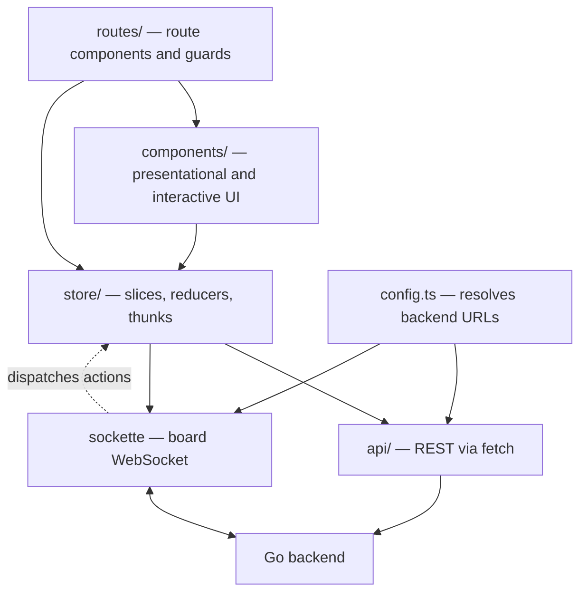
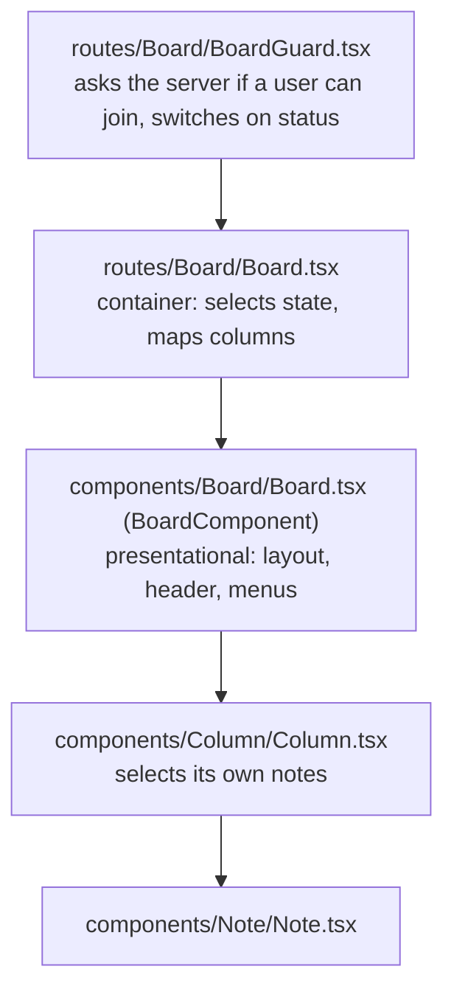

## Layers



Pay special attention to the dotted arrow. Components dispatch thunks, thunks call REST, and the resulting state change
arrives back **over the WebSocket** as a separate action. State is not updated by the thunk that caused the change, a thunk that writes to a board does not touch the store. An action is dispatched and a reducer is run only after the server pushes the state change to every connected client over the WebSocket. The reason for this architecture is that by forcing state updates to happen exclusively via WebSocket events, the app treats local edits and remote edits identically (broadcasting them to everyone rather than applying them locally first). This ensures the seamless, real-time collaboration the application is built to deliver.

For more information on how state is managed in this application see [State Management Docs](/docs/src/content/docs/dev/Frontend/state-management.md)

## Entry point

`src/index.tsx` is short and worth reading in full. It:

1. Stores the app version from `import.meta.env.VITE_VERSION` in `localStorage`.
2. Initialises [Plausible](https://plausible.io) analytics if `ANALYTICS_DATA_DOMAIN` and `ANALYTICS_SRC` are set.
   Board URLs are SHA-256-hashed before being reported, so board ids never leave the browser in plain text.
3. Renders the provider stack (Redux state management provider "store", translation provider "i18n",...) into `#root`
4. Checks if you are already logged in and populates `state.auth` with user information

Be aware that `<Html />` is not markup. It uses `react-helmet-async` to set the `lang` and `data-theme` attributes on the `<html>`
element. That single attribute drives the entire dark mode implementation (see
[Styling & Theming](/docs/src/content/docs/dev/Frontend/styling.md)).

<!---TO DO: Microsoft Clarity-->

## Routing

`src/routes/Router.tsx` sets up a `BrowserRouter`. Note the import path — this is React Router **v8**:

```tsx
import {BrowserRouter, Navigate, Route, Routes} from "react-router";
```

There is no `react-router-dom` in this project. Importing from it will fail to resolve.

**Dialogs are routes, not local state.** `/board/:boardId/settings/appearance`, `/board/:boardId/voting`,
`/board/:boardId/timer` and `/board/:boardId/note/:noteId/stack` are all nested routes rendered into the parent's
`<Outlet />`. The same is true of the settings dialog on the `/boards/*` pages. If you are adding a dialog, you need to add a route. This ensures that when the URL is shared to another participant, important popups do not disappear when the URL is opened.

`RouteChangeObserver` sits inside the router and mirrors the current path into `state.view.route`, which the hotkey and
analytics code reads.

### Route Guards

**`RequireAuthentication`** (`src/routes/RequireAuthentication.tsx`) evaluates `state.auth` to either display a loading screen (while auth initializes), show an error page (if initialization fails), render the page (if logged in), or redirect unauthenticated users to /login (saving their original route so they can be sent back after logging in).

**`VerifiedAccountGuard`** (`src/routes/Guards/VerifiedAccountGuard.tsx`) blocks anonymous users from creating or editing
templates, unless the server allows it. The route passes `override={allowAnonymousCustomTemplates}`.

## How a board renders

Four components share the name "board" in some form, and they have very
different jobs.



`components/Column/Column.tsx` selects its own data, meaning each column subscribes to the store, filters out stacked notes, applies the "show notes of other users" setting, and renders only note **ids** into `Note` components. This approach prevents performance drag since data is not passed down to every column so updating a note does not cause every column to redraw itself.

The practical consequence: if you need more note data in a column or a note, add a selector there. Do not thread it through `BoardComponent`.

## The API client

`src/api/index.ts` spreads one module per resource into a single object, where every resource module contains functions that write out their own backend `fetch` requests, status check, and JSON parsing to execute backend tasks (like creating a board, editing a column,...)

(Note: `src/api/request.ts` handles board join requests from users, not HTTP request utilities.)

Adding an endpoint means adding a function to the matching resource module and also, if it is a new resource, spreading the
new module into `API`. Endpoint documentation lives with the backend: see [API docs](/docs/src/content/docs/dev/backend/api_docs.md).

## Where types live

`src/types/` holds only general types:

- `websocket.ts` — the `ServerEvent` and `ClientMessage` unions.
- `avatar.ts`, `i18next.d.ts`, `emoji-picker.d.ts`.

**Domain types live with the slice that owns them**, in `src/store/features/<slice>/types.ts`.

When you are looking for a domain type, check the slice first. They are re-exported through `store/features`, so
`import {Note, ParticipantRole} from "store/features"` works from anywhere.

## Export, import and print

Three related paths that are easy to break without noticing:

- **Export** — `src/utils/export.ts` calls `API.exportBoard(id, "application/json")`, joins the participant list with
  user data via `mapMultipleParticipants`, **strips participant ids** from the result, and saves the file with
  `file-saver`. There is a CSV path alongside the JSON one.
- **Print** — `/board/:boardId/print` renders `components/SettingsDialog/ExportBoard/PrintView`, which uses
  `react-to-print`.
- **Import** — `components/ImportBoard` is the inverse, posting to `/import` via `API.importBoard`.

If you change the shape of `Board`, `Note`, `Column` or `Participant`, check these three.
