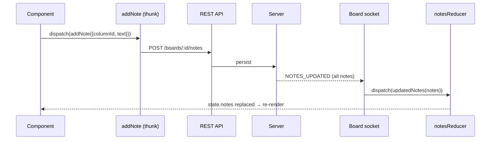

All shared state lives in a single Redux store, built with Redux Toolkit. This page covers how it is organised and how state actually changes, which is not the way a Redux app usually works.

If you are new to Redux Toolkit itself, the [official documentation](https://redux-toolkit.js.org/) is better than
anything repeated here. This page assumes you know what an action, a reducer and a thunk are.

## Store shape

`src/store/store.ts` composes the slices and exports the typed helpers you should always use.

Import them from `"store"` and never `useSelector` / `useDispatch` from `react-redux` directly, or you lose the typing.

`recentEmojis`, `skinTone` and parts of `view` are persisted to `localStorage`. Everything else is rebuilt from the
server on every board join.

## Anatomy of a slice

Every slice is a directory under `src/store/features/` with the same five files:

```
store/features/notes/
├── actions.ts    plain createAction definitions
├── reducer.ts    createReducer over those actions
├── thunks.ts     createAsyncThunk — API calls and side effects
├── types.ts      the domain type (Note) and the slice state type (NotesState)
└── index.ts      export * from each of the above
```

`src/store/features/index.ts` re-exports every slice, so a component imports from the barrel:

```tsx
import {useAppDispatch, useAppSelector} from "store";
import {addNote, deleteNote, Note} from "store/features";
```

## The naming convention

This is the one convention where getting it wrong produces code that silently does nothing rather than an error, so it is
worth learning before you write anything.

| Shape | Example | What it does | Handled by a reducer? |
| --- | --- | --- | --- |
| **imperative thunk** | `addNote`, `editNote`, `deleteNote` | calls the REST API, returns `void` | **no** |
| **past-tense action** | `updatedNotes`, `deletedNote`, `addedReaction` | dispatched **only** from a socket handler | **yes** |
| **`…Optimistically`** | `editColumnOptimistically` | changes local state only, never persisted | yes |
| **`broadcast…`** | `broadcastNoteDragStart` | fire-and-forget message over the socket | no |

The `…Optimistically` actions exist for the template editor and the column configurator, where the user is arranging
things before saving. They are the exception, not the pattern, so do not reach for them to make a board mutation feel
faster.

**A helpful debugging rule:** if you dispatch a thunk and nothing changes on screen, the bug is almost
never in the thunk. It is a missing socket event, a missing branch in the socket handler, or a missing reducer case.

## The round trip

Adding a note looks like this end to end:



1. The user submits a note. The component dispatches `addNote({columnId, text})`.
2. The thunk reads the board id from `getState()` and calls `API.addNote(...)`. It returns `void`.
3. The server persists the note and emits a `NOTES_UPDATED` event on the board socket.
4. The `onmessage` handler in `permittedBoardAccess` (`store/features/board/thunks.ts`) matches the event type and
   dispatches `updatedNotes(notes)`.
5. `notesReducer` handles `updatedNotes` by replacing the whole array:

   ```ts
   .addCase(updatedNotes, (_state, action) => action.payload)
   ```

6. Every component subscribed to `state.notes` re-renders — including the one belonging to the participant who added the
   note, and the ones belonging to everyone else on the board.

**`NOTES_UPDATED` carries the complete `Note[]` for the board, not just the note that changed.** The same is true of
`COLUMNS_UPDATED` and `PARTICIPANTS_UPDATED`. That is why reducers replace rather than patch, and why the **selector
equality rule** is not optional.

`deletedNote` is the one genuinely complex reducer in the `notes` slice: it re-parents stacked notes and re-ranks their
siblings client-side, because the server sends only the deleted id. It has its own tests in
`store/features/notes/__tests__/`.

### Selector equality

Because the server pushes **whole collections** rather than deltas, the
`notes` array is replaced by a new array on every relevant socket message. A selector that builds a new object or array
therefore returns a fresh reference every time, and the component re-renders even when nothing it cares about changed. On
a busy board that means constant re-rendering.

The fix used throughout the codebase is `_.isEqual` from `underscore` as `useAppSelector`'s second argument:

```tsx
import _ from "underscore";

const notes = useAppSelector(
  (state) => state.notes.filter((note) => note.position.column === id).map((note) => note.id),
  _.isEqual
);
```

**The rule:** a selector returning a primitive needs no second argument. A selector returning an object or an array
needs `_.isEqual`. This is why `underscore` is a dependency and not a legacy leftover.
`routes/Board/Board.tsx` and `components/Column/Column.tsx` are the canonical examples.

## Writing a thunk

Every write thunk follows the same shape: read what you need from `getState()`, call the API through `retryable`, return
nothing.

The three generic parameters are the return type, the payload type and the store type. Always pass `{state: ApplicationState}` as the store type

You *can* let a reducer handle `someThunk.fulfilled` when the value is genuinely local (`setTheme`, `setLanguage`,
`setServerInfo` all do this). For anything that other participants must also see, let the socket event do it.

## Error handling: `retryable`

`src/store/retryable.ts` wraps an API call so that a failure shows a toast with a *Retry* button, which re-dispatches the
same thunk:

```ts
retryable(
  () => API.addNote(boardId, payload.columnId, payload.text),  // the call
  dispatch,                                                     // the store's dispatch
  () => addNote({...payload}),                                  // a factory for the retry
  "addNote"                                                     // the translation key
);
```

It rethrows after showing the toast, so callers can still `.catch()`.

The fourth argument is typed:

```ts
type ErrorKey = keyof (typeof resources.en.translation)["Error"];
```

So **a new error key has to exist in `src/i18n/en/translation.json` under `Error` before your thunk will compile.** If
you get an unexpected type error on that argument, that is why. Add the key to all three locales (see [Contributing Translations](/docs/src/content/docs/dev/Frontend/translating.md).)

## Realtime: the two WebSockets

Both use [`sockette`](https://github.com/lukeed/sockette), and both live inside a thunk rather than in a separate
transport layer.

### The board socket

Opened by `permittedBoardAccess` in `store/features/board/thunks.ts`, at
`${SERVER_WEBSOCKET_URL}/boards/{boardId}`. Its `onmessage` handler parses a `ServerEvent` and runs a long chain of
`if (message.type === …)` branches, each dispatching one past-tense action. It is closed by `leaveBoard`.

Outbound messages go through the module's own helper:

```ts
export const sendWebSocketMessage = (message: ClientMessage) => {
  if (socket) {
    socket.json(message);
  }
};
```

The inbound `ServerEvent` union is defined in `src/types/websocket.ts` and contains around 25 event types, grouped by subject.

`INIT` is special: it carries the entire board (board, columns, notes, reactions, votes, votings, requests, participants)
and is folded into every slice at once through a single `initializeBoard` action. `BOARD_REACTION_ADDED` is the other odd
one — the handler schedules a `removeBoardReaction` after 5 seconds, which is why board-wide emoji bursts disappear on
their own.

`ClientMessage`, the outbound union, currently has exactly one member: `DragLockMessage`.

### The join/pending socket

Opened by `pendingBoardAccessConfirmation` in `store/features/requests/thunks.ts`. When `joinBoard` gets a `PENDING`
response from the API, it means a moderator has to approve you; this second socket waits for that decision. Its messages
are bare strings, not objects:

```ts
if (message === "SESSION_ACCEPTED") {
  dispatch(permittedBoardAccess(payload.board));
} else if (message === "SESSION_REJECTED") {
  dispatch(rejectedBoardAccess());
}
```

`permittedBoardAccess` is what opens the board socket, so the two are chained. Once access is granted the join socket is
closed.

### Adding a new realtime event

1. Add the event interface to `src/types/websocket.ts` and include it in the `ServerEvent` union.
2. Add a **past-tense** action to the owning slice's `actions.ts`.
3. Handle that action in the slice's `reducer.ts`.
4. Add an `if (message.type === "YOUR_EVENT")` branch to the handler in `store/features/board/thunks.ts`.
5. Make sure the backend actually emits it — see [Backend architecture](/docs/src/content/docs/dev/Backend/architecture.md).

Skipping step 4 is the usual mistake: the type exists, the reducer exists, and nothing happens.

## Multi-user drag locks

When someone starts dragging a note, `broadcastNoteDragStart` sends a `DRAG_LOCK_MESSAGE` with
`action: "ACQUIRE"`; releasing sends `"RELEASE"`. The server relays it, and `state.dragLocks.lockedNotes[noteId]` records
which participant holds the lock. That value disables dragging for everyone else and shows a `DragIndicatorPill` on the
note.

The send is deliberately fire-and-forget and `updateNoteDragState` swallows errors so a drag is never interrupted. Implementation details are in [Components](/docs/src/content/docs/dev/Frontend/components.md#drag-and-drop).
