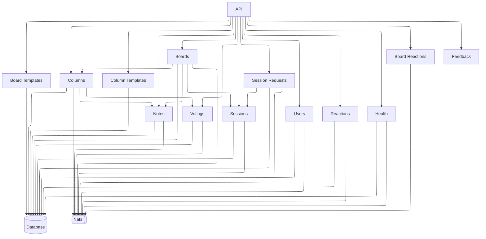
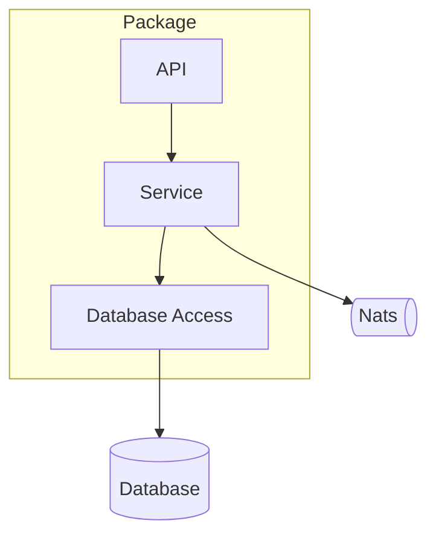

# Backend Architecture

In the following diagram the packages of the backend and how they interact with each other are shown.

## Package structure

A general package structure is shown in the diagram below.

Each package has at least an api and a service.
If the service needs access to the database, a database access is created.
If the service needs access to a database, which is not under the control of that service, the corresponding service is injected.
For access to the message broker, the `realtime` package is used.
